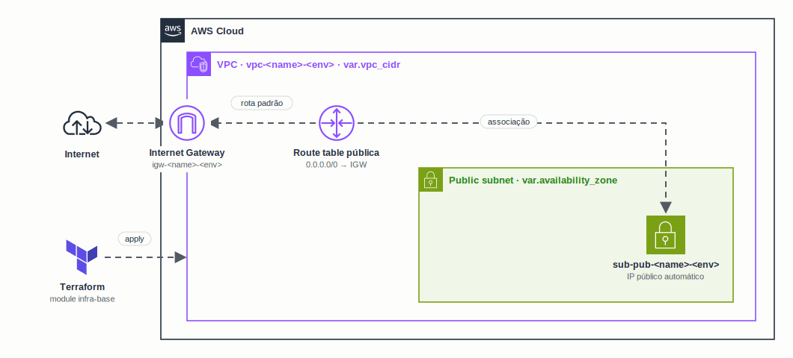

<h1 align="center">
  Lab de Módulos Terraform na AWS
</h1>

<p align="center">
  
</p>

<p align="center">
  <a href="https://skillicons.dev">
    
  </a>
</p>

## Qual a finalidade do projeto?

Laboratório para construir uma **biblioteca de módulos Terraform reutilizáveis** para a **AWS**, em dupla. Cada módulo resolve uma parte da infraestrutura e pode ser combinado com os outros para montar ambientes completos.

O primeiro módulo é o **`infra-base`**: a rede mínima para colocar qualquer coisa na internet, com **VPC**, **subnet pública**, **Internet Gateway** e **route table** com a rota padrão. Os próximos módulos vão usar os outputs dele (VPC e subnet) como entrada.

## O que foi construído

### Módulos

| Módulo | Caminho | Status |
|---|---|---|
| infra-base | `terraform-modules/infra-base` | VPC, subnet pública, Internet Gateway e route table |

### Recursos do `infra-base`

| Recurso | Nome | Descrição |
|---|---|---|
| `aws_vpc` | `vpc-<name>-<env>` | VPC com DNS hostnames habilitado |
| `aws_subnet` | `sub-pub-<name>-<env>` | Subnet pública com IP público automático (`map_public_ip_on_launch`) |
| `aws_internet_gateway` | `igw-<name>-<env>` | Saída para a internet |
| `aws_route_table` | `rt-pub-<name>-<env>` | Rota `0.0.0.0/0` apontando para o Internet Gateway |
| `aws_route_table_association` | – | Liga a route table à subnet pública |

### Entradas

| Variável | Descrição |
|---|---|
| `name` | Nome base dos recursos |
| `env` | Ambiente (ex.: `dev`, `prod`) |
| `vpc_cidr` | CIDR da VPC |
| `subnet_cidr` | CIDR da subnet pública |
| `availability_zone` | AZ da subnet pública |

### Saídas

| Output | Descrição |
|---|---|
| `vpc_id` | ID da VPC |
| `subnet_pub_id` | ID da subnet pública |
| `igw_id` | ID do Internet Gateway |
| `route_table_pub_id` | ID da route table pública |

## Tecnologias utilizadas

- **Terraform** (`>= 1.5`): infraestrutura como código, organizada em módulos;
- **Provider AWS** (`>= 5.0`): recursos de rede na AWS;
- **Amazon VPC:** VPC, subnet, Internet Gateway e route table;
- **terraform-docs:** documentação gerada automaticamente em cada módulo.

## Estrutura do repositório

```text
studies-lab-terraform-modules/
├── terraform-modules/
│   └── infra-base/              # Módulo de rede base
│       ├── version.tf           # Versões do Terraform e do provider
│       ├── variables.tf         # Entradas
│       ├── vpc.tf               # VPC
│       ├── sub_pub.tf           # Subnet pública
│       ├── igw.tf               # Internet Gateway
│       ├── rt.tf                # Route table pública
│       ├── rta.tf               # Associação route table ↔ subnet
│       ├── outputs.tf           # Saídas
│       └── README.md            # Documentação do terraform-docs
├── docs/arch.gif                # Diagrama da arquitetura
└── README.md
```

## Fluxo de funcionamento

1. O módulo cria a **VPC** com o CIDR informado.
2. Dentro dela, cria a **subnet pública** na AZ escolhida, com IP público automático.
3. Cria o **Internet Gateway** e anexa na VPC.
4. Cria a **route table pública** com a rota `0.0.0.0/0` para o Internet Gateway.
5. **Associa** a route table à subnet: tudo o que subir nela passa a ter acesso à internet.
6. Devolve os IDs nos outputs para os próximos módulos usarem.

## Como usar

```hcl
module "infra_base" {
  source = "./terraform-modules/infra-base"

  name              = "lab"
  env               = "dev"
  vpc_cidr          = "10.0.0.0/16"
  subnet_cidr       = "10.0.1.0/24"
  availability_zone = "us-east-1a"
}
```

```bash
terraform init
terraform plan
terraform apply
```

## Como validar a entrega

Em uma validação end-to-end, o `terraform apply` deve criar a rede e uma instância colocada na subnet deve conseguir sair para a internet.

Pontos principais de validação:

- `terraform validate` sem erros;
- `terraform plan` listando os 5 recursos do módulo;
- VPC, subnet, Internet Gateway e route table criados com as tags `<tipo>-<name>-<env>`;
- rota `0.0.0.0/0` apontando para o Internet Gateway e associada à subnet;
- outputs `vpc_id`, `subnet_pub_id`, `igw_id` e `route_table_pub_id` preenchidos;
- `terraform destroy` removendo tudo ao final.

## Autores

- **William Alves Coelho** · [@willtechdev](https://github.com/willtechdev)
- **Eduardo Castro** · [@duhcastro222-rgb](https://github.com/duhcastro222-rgb)
